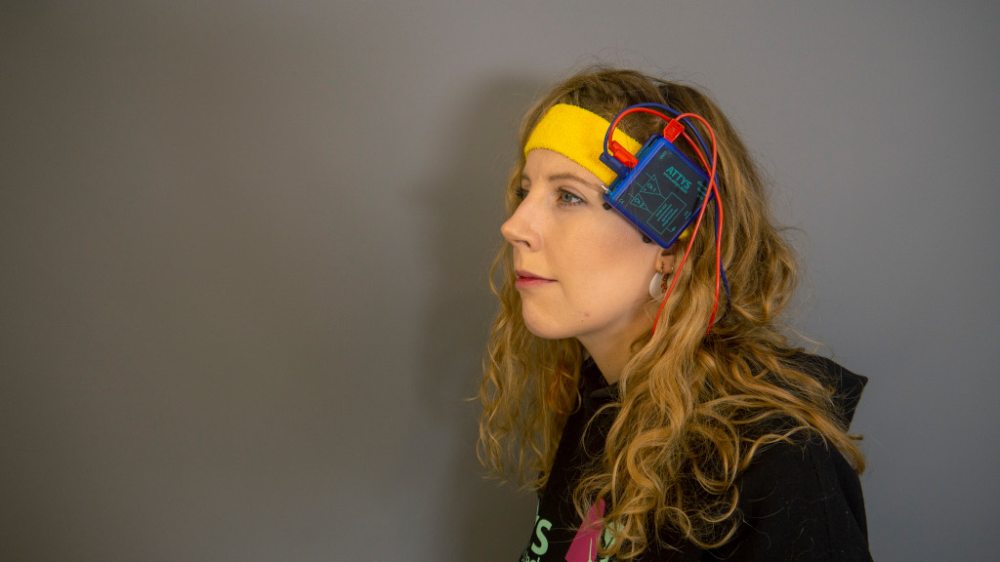

# attys-ep

Visually evoked potential app for [Attys](http://www.attys.tech)
for Windows/Linux


attys-ep performs averaging over repetitive stimuli: visually
evoked potentials and P300.

Both the raw data with the trigger and the averaged EP can
be saved. Both formats use tab separated values which can
be imported by virtually any program, for example python,
MATLAB or excel.

# Installation

## Linux

### Linux Ubuntu packages for Ubuntu LTS
Add these two repositories...
```
sudo add-apt-repository ppa:berndporr/attys
sudo add-apt-repository ppa:berndporr/dsp
```
...and then select `attys-ep` in your favourite package manager. This will then install also
the other required packages.

### Compilation from source

You need the following libraries to compile and run the program:

- attys-comm (https://github.com/glasgowneuro/attys-comm): `apt-get install attyscomm-dev`
- Qt5 / Qwt standard UBUNTU packages: `apt-get install qt5-default libqwt-headers libqwt-qt5-dev`
- IIR filter library (https://github.com/berndporr/iir1): `apt-get install iir1-dev`

- Linux: `qmake`, `make`

## Windows

### Installer

Install the MSI file (not signed):
https://github.com/glasgowneuro/attys-ep/tree/master/installer/Release

### From source
Install:
- attys-comm: https://github.com/glasgowneuro/attys-comm
- Qwt for QT5: https://sourceforge.net/projects/qwt/files/qwt/6.1.3/ (compile it in the VS64bit console)
- IIR filter library: https://github.com/berndporr/iir1

Edit `attys-ep.pro` and point it to attys-comm, qwt-6.1.3 and the iir library

Run `qmake -tp vc` and compile the solution with Visual Studio 2019.

# Running attys-ep



Just type: `attys-ep` or `./attys-ep`

# Data formats

## Evoked potental (event triggered averaging)

Every row contains two columns:
```
time (ms)      evoked potential (volt)
```

See `example_vep.tsv` for an example of a visually evoked potential.

## Continous recording

Every row contains three columns:
```
unfiltered channel 1 (volt)      unfiltered channel 2 (volt)      trigger
```
the sampling rate is 500Hz for the Attys2 and 250Hz for the Attys1.

In the `python` directory is the script `calc_ep.py` which calculates the evoked
potential from the raw data.

# Credits

attys-ep is based in part on the work of the Qwt project (http://qwt.sf.net).
